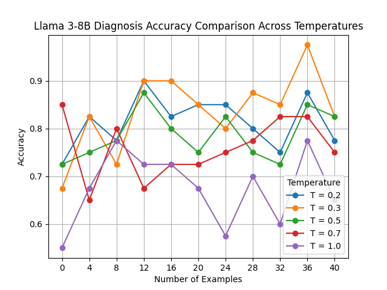
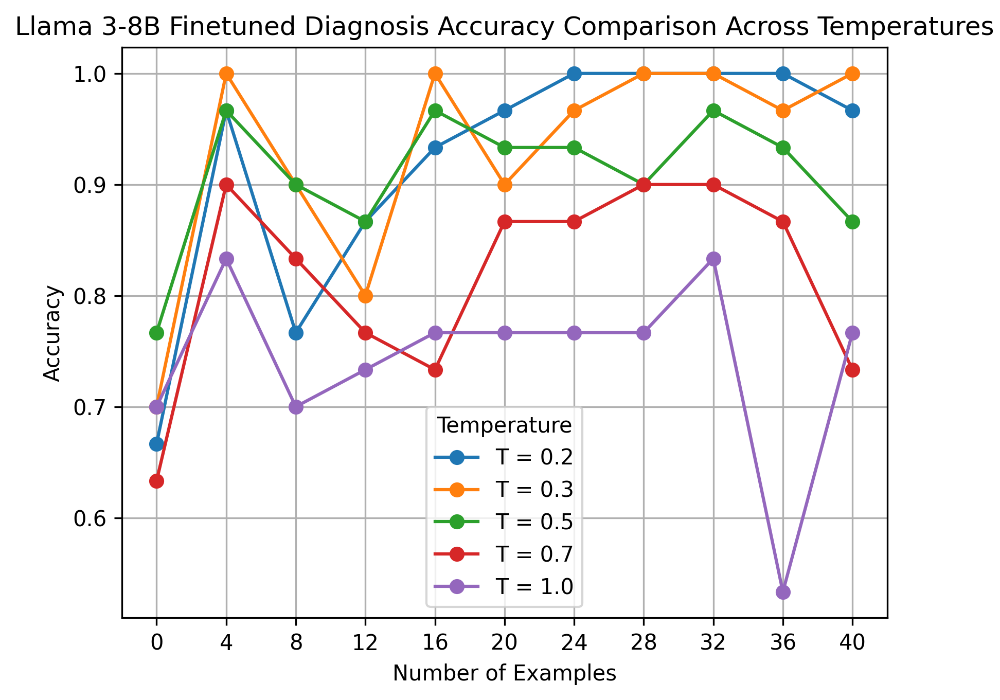

# Prompt Experiments
Various Advanced Prompt Engineering Techniques were tried, such as:
- Few-Shot Prompting
- Chain of Thought (CoT)
- Tree of Thought (ToT) and more

Refer to the [summary report](Advanced_Prompt_Engineering_Summary.pdf) for the results and metrics.

The Llama3-8B Model Finetuning is here at [this Kaggle Kernel](https://www.kaggle.com/code/bharatr123/llama-finetune-bigdatasystems-project) and inference in [this Colab Notebook](https://colab.research.google.com/drive/1U5G9lXF2qre4LweDak-jQ6kvnSWIxOaq)

The results on the Llama3-8B Model are shown:

| Before Finetuning | After Finetuning |
| ----------------------------------- | ----------------------------------- |
|  |  |

The project demo comparing various LLMs can also be visualized [here](https://huggingface.co/spaces/Asolanki97/LLM_Comparator).
